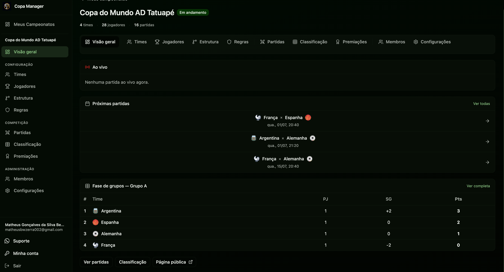
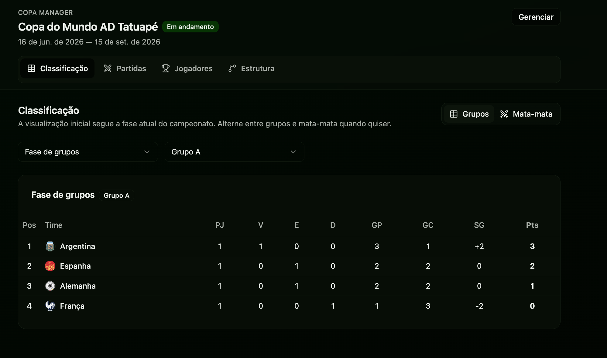

# Copa Manager ⚽

<p align="center">
  <a href="#preview">Preview</a> •
  <a href="#ia-e-cursor">IA & Cursor</a> •
  <a href="#tecnologias">Tecnologias</a> •
  <a href="#rodar">Rodar o projeto</a> •
  <a href="#funcionalidades">Funcionalidades</a> •
  <a href="#arquitetura">Arquitetura</a> •
  <a href="#colaboradores">Colaboradores</a> •
  <a href="#contribuicao">Contribuição</a>
</p>

<p align="center">
  <b>Plataforma web para criar, gerenciar e acompanhar campeonatos esportivos — com painel administrativo, classificação automática, fases em grupos e mata-mata, eventos de partida e páginas públicas para espectadores.</b>
</p>

<p align="center">
  <a href="https://copa-manager.vercel.app/">
    
  </a>
</p>

## 🎬 Preview

Acesse o app em produção:

| Recurso | Link |
|--------|------|
| **Home** | [copa-manager.vercel.app](https://copa-manager.vercel.app/) |
| **Campeonato público (exemplo)** | [Copa do Mundo AD Tatuapé — Classificação](https://copa-manager.vercel.app/c/copa-do-mundo-ad-tatuape/standings) |

### Painel administrativo

<p align="center">
  <a href="https://copa-manager.vercel.app/">
    
  </a>
</p>

<p align="center">
  <sub>Visão geral do campeonato com próximas partidas, classificação e atalhos para gerenciamento.</sub>
</p>

### Página pública

<p align="center">
  <a href="https://copa-manager.vercel.app/c/copa-do-mundo-ad-tatuape/standings">
    
  </a>
</p>

<p align="center">
  <sub>Classificação pública do <a href="https://copa-manager.vercel.app/c/copa-do-mundo-ad-tatuape/standings">Copa do Mundo AD Tatuapé</a> — acessível sem login.</sub>
</p>

> O frontend está hospedado na [Vercel](https://vercel.com/). O backend roda na [Render](https://render.com/) com banco [Neon](https://neon.tech/) (PostgreSQL serverless).

---

## 🤖 IA & Cursor

Este projeto foi construído com **desenvolvimento assistido por IA** usando o [Cursor](https://cursor.com/) — IDE com agentes que entendem o contexto do repositório.

### Como a IA é guiada

| Arquivo / pasta | Papel |
|-----------------|-------|
| [`AGENTS.md`](./AGENTS.md) | Contexto principal para agentes: prioridade dos documentos, regras de negócio e convenções de código |
| [`.docs/`](./.docs/) | Especificação do produto — fonte da verdade antes de qualquer implementação |
| [`.cursor/`](./.cursor/) | Configuração do Cursor (MCP servers, integrações) |

### Documentação orientada a agentes

Antes de implementar qualquer feature, a IA consulta os documentos em `.docs/` na ordem definida em `AGENTS.md`:

1. `requirements.md` — regras de negócio, fluxos e permissões
2. `domain-model.md` — entidades, relacionamentos e enums
3. `database-design.md` — tabelas, colunas e constraints
4. `api-spec.md` — contrato REST entre frontend e backend
5. `architecture-backend.md` — camadas e estrutura do backend
6. `architecture-frontend.md` — camadas e estrutura do frontend

**Regras para agentes:**

- Não inventar regras de negócio
- Não criar entidades fora do domínio documentado
- Não alterar contratos sem atualizar a documentação

Checklists de implementação por etapa: `frontend-implementation-checklist.md` e `backend-implementation-checklist.md`.

### MCP no Cursor

A pasta [`.cursor/`](./.cursor/) configura servidores MCP usados pelos agentes — por exemplo, [Context7](https://context7.com/) para buscar documentação atualizada de bibliotecas (React, Fastify, Prisma, TanStack Router, etc.) diretamente no chat.

---

## 💻 Tecnologias

### Frontend (`frontend/`)

- [React 19](https://react.dev/) + [TypeScript](https://www.typescriptlang.org/)
- [Vite 8](https://vite.dev/) — bundler e dev server
- [TanStack Router](https://tanstack.com/router) — rotas file-based com type safety
- [TanStack React Query 5](https://tanstack.com/query) — cache, queries e mutations
- [Zustand](https://zustand.docs.pmnd.rs/) — estado global (sessão, UI)
- [Axios](https://axios-http.com/) — cliente HTTP com interceptors de auth
- [shadcn/ui](https://ui.shadcn.com/) — Radix UI + [Tailwind CSS 4](https://tailwindcss.com/)
- [React Hook Form](https://react-hook-form.com/) + [Zod 4](https://zod.dev/) — formulários e validação
- [nuqs](https://nuqs.dev/) — query strings tipadas na URL
- [date-fns](https://date-fns.org/), [Lucide React](https://lucide.dev/), [Sonner](https://sonner.emilkowal.ski/) (toasts)
- [ESLint 10](https://eslint.org/) + [Prettier](https://prettier.io/)

### Backend (`backend/`)

- [Node.js](https://nodejs.org/) + [TypeScript](https://www.typescriptlang.org/)
- [Fastify 5](https://fastify.dev/) — framework HTTP
- [Zod](https://zod.dev/) + [fastify-type-provider-zod](https://github.com/turkerdev/fastify-type-provider-zod) — validação e OpenAPI
- [Prisma 7](https://www.prisma.io/) — ORM com [PostgreSQL](https://www.postgresql.org/)
- [JWT](https://jwt.io/) (`@fastify/jwt`) — autenticação Bearer + refresh token
- [Scalar](https://scalar.com/) — documentação interativa da API (`/docs`)
- [Resend](https://resend.com/) + [React Email](https://react.email/) — e-mails transacionais (convites, reset de senha)
- [bcryptjs](https://github.com/dcodeIO/bcrypt.js) — hash de senhas
- [tsup](https://tsup.egoist.dev/) — build para produção

### Infraestrutura

| Serviço | Uso |
|--------|-----|
| [Vercel](https://vercel.com/) | Deploy do frontend (SPA) |
| [Render](https://render.com/) | Deploy da API (Docker) — ver [`render.yaml`](./render.yaml) |
| [Neon](https://neon.tech/) | PostgreSQL serverless (pooler + migrations Prisma) |

---

## 🚀 Rodar o projeto

### Pré-requisitos

- [Node.js 20+](https://nodejs.org/) (recomendado)
- [npm](https://www.npmjs.com/)
- [Git](https://git-scm.com/)
- Banco PostgreSQL (local ou [Neon](https://neon.tech/))

### Clonar o repositório

```bash
git clone https://github.com/Matheus-Bezerra/copa-manager.git
cd copa-manager
```

### Backend

```bash
cd backend
npm install
cp .env.example .env
```

Configure o `.env` com `DATABASE_URL`, `DIRECT_URL`, `JWT_SECRET` e demais variáveis (veja `.env.example`).

```bash
npm run db:generate
npm run db:migrate
npm run db:seed        # opcional — dados de exemplo
npm run dev
```

A API sobe em [http://localhost:3333](http://localhost:3333).

- Base URL: `http://localhost:3333/api/v1`
- Documentação (com `ENABLE_SWAGGER=true`): [http://localhost:3333/docs](http://localhost:3333/docs)
- Health check: `GET /api/v1/health`

### Frontend

Em outro terminal:

```bash
cd frontend
npm install
cp .env.example .env
npm run dev
```

O app abre em [http://localhost:5173](http://localhost:5173). O `.env` aponta `VITE_API_URL` para o backend local.

### Scripts úteis

| Comando | Onde | Descrição |
|--------|------|-----------|
| `npm run dev` | `backend/` / `frontend/` | Servidor de desenvolvimento |
| `npm run build` | ambos | Build de produção |
| `npm run lint` | ambos | ESLint |
| `npm run format` | ambos | Prettier (write) |
| `npm run db:migrate` | `backend/` | Migrations Prisma |
| `npm run db:studio` | `backend/` | Prisma Studio |
| `npm run db:seed` | `backend/` | Seed do banco |

---

## 📍 Funcionalidades

### Autenticação & perfil

| Recurso | Descrição |
|--------|-----------|
| Registro / login | Conta com nome, e-mail e senha |
| Sessão | JWT com refresh automático |
| Perfil | Edição de nome e avatar |
| Recuperação de senha | E-mail via Resend |

### Campeonatos

| Recurso | Descrição |
|--------|-----------|
| CRUD | Criar, editar, encerrar e arquivar campeonatos |
| Status | Draft, Open, In Progress, Finished, Archived |
| Slug público | URL amigável (`/c/nome-do-campeonato/...`) |
| Regulamento | Texto editável por campeonato |
| Regras | Pontuação, desempate e critérios configuráveis |
| Membros | Owner, Administrator e Organizer com convites por e-mail |

### Times & jogadores

| Recurso | Descrição |
|--------|-----------|
| Times | CRUD, identidade visual, associação de jogadores |
| Jogadores | Cadastro sem conta de usuário, estatísticas e cartões |

### Partidas & eventos

| Recurso | Descrição |
|--------|-----------|
| Partidas | Agendamento, resultado, pênaltis, cancelamento |
| Eventos | Gols, cartões, melhor jogador da partida |
| Impacto automático | Estatísticas e classificação atualizadas em tempo real |

### Fases & classificação

| Recurso | Descrição |
|--------|-----------|
| Grupos | `GROUP_STAGE` com turno único ou ida e volta |
| Mata-mata | `KNOCKOUT` com geração automática de chaves |
| Classificação | Pontos, vitórias, saldo de gols e critérios de desempate |
| Premiações | Artilharia, fair play e prêmios por partida |

### Área pública

| Recurso | Descrição |
|--------|-----------|
| Visualização | Classificação, partidas, estatísticas e regulamento |
| Sem login | Espectadores acessam campeonatos públicos |

**Exemplo ao vivo:** [Copa do Mundo AD Tatuapé — Classificação](https://copa-manager.vercel.app/c/copa-do-mundo-ad-tatuape/standings)

---

## 🏗 Arquitetura

Monorepo com frontend e backend separados, contrato definido em `.docs/api-spec.md`.

### Backend — Clean Architecture

```text
backend/src/
├── http/           # Rotas, controllers, schemas Zod, middlewares
├── use-cases/      # Regras de negócio
├── repositories/   # Interfaces de persistência
├── prisma/         # Implementações Prisma
├── services/       # Lógica de competição, standings, e-mail
└── config/         # Env, CORS, JWT, Swagger
```

Rotas sob `/api/v1` — auth, championships, teams, players, stages, matches, standings, public.

### Frontend — features + camadas

```text
frontend/src/
├── pages/          # TanStack Router (file-based)
├── components/     # UI (shadcn) + compartilhados
├── http/           # Cliente Axios, types, hooks React Query
├── stores/         # Zustand
├── hooks/          # Hooks de UI
└── utils/          # Formatters, filtros, helpers
```

**Fluxo de rotas:**

- `/_auth` — login, registro, recuperação de senha
- `/_app` — painel autenticado (campeonatos, times, partidas…)
- `/c/$slug` — páginas públicas do campeonato

---

## 🤝 Colaboradores

<table>
  <tr>
    <td align="center">
      <a href="https://github.com/Matheus-Bezerra">
        <br>
        <sub>
          <b>Matheus Bezerra</b>
        </sub>
      </a>
      <br>
      <a href="mailto:matheusbwzerra002@gmail.com">matheusbwzerra002@gmail.com</a>
      <br>
      <a href="https://www.linkedin.com/in/matheus-bezerra04/">LinkedIn</a>
    </td>
  </tr>
</table>

---

## 📫 Contribuição

1. `git clone https://github.com/Matheus-Bezerra/copa-manager.git`
2. `git checkout -b feature/NOME_DA_FEATURE`
3. Leia [`AGENTS.md`](./AGENTS.md) e a documentação em [`.docs/`](./.docs/) antes de alterar contratos ou regras de negócio
4. Siga o padrão de commits do time
5. Abra um Pull Request explicando a feature ou correção

### Documentações úteis

- [Cursor — documentação](https://cursor.com/docs)
- [AGENTS.md](./AGENTS.md) — contexto para agentes de IA
- [Requirements](./.docs/requirements.md) — requisitos do produto
- [API Spec](./.docs/api-spec.md) — contrato REST
- [Como criar um Pull Request](https://docs.github.com/pt/pull-requests/collaborating-with-pull-requests/proposing-changes-to-your-work-with-pull-requests/creating-a-pull-request)
- [Padrão de commits (iuricode)](https://github.com/iuricode/padroes-de-commits)
